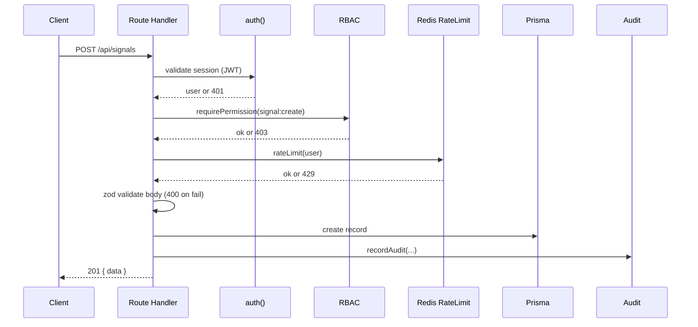

# API Architecture

All endpoints live under `apps/web/src/app/api` as Next.js Route Handlers.
Every mutating endpoint follows the same pipeline:

## Endpoint Catalog

| Method | Path                     | Auth | Permission        | Purpose                          |
| ------ | ------------------------ | ---- | ----------------- | -------------------------------- |
| GET    | `/api/health`            | none | —                 | Liveness (db + redis)            |
| POST   | `/api/auth/register`     | none | — (IP rate-lim)   | Create account                   |
| *      | `/api/auth/[...nextauth]`| —    | —                 | NextAuth (login/oauth/session)   |
| GET    | `/api/signals`           | yes  | —                 | List active signals              |
| POST   | `/api/signals`           | yes  | `signal:create`   | Publish a signal                 |
| GET    | `/api/portfolio`         | yes  | —                 | List user portfolios + open pnl  |
| POST   | `/api/backtest`          | yes  | `backtest:run`    | Enqueue a backtest               |
| POST   | `/api/webhooks/stripe`   | sig  | —                 | Stripe subscription sync         |
| POST   | `/api/webhooks/razorpay` | sig  | —                 | Razorpay subscription sync       |
| GET    | `/api/cron`              | bearer| —                | Cron: expire signals, run AI     |

## Conventions

- **Validation**: zod schemas on every body; `400` returns `error.flatten()`.
- **Errors**: `401` unauthenticated, `403` forbidden, `429` rate-limited,
  `400` invalid, `409` conflict.
- **Rate limiting**: Redis fixed-window per user/IP, tunable via env.
- **Idempotency**: webhooks are signature-verified and safe to retry.
