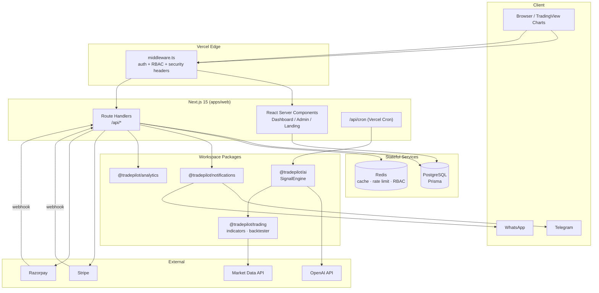

# TradePilot AI — System Architecture

Production-grade AI trading-signals SaaS built as a Turborepo monorepo on Next.js 15
(App Router), PostgreSQL + Prisma, Redis, and OpenAI.

## 1. Monorepo Topology

```
tradepilot-ai/
├── apps/
│   └── web/                  # Next.js 15 App Router (UI + API + middleware)
├── packages/
│   ├── config/               # env validation (zod) + shared constants
│   ├── db/                   # Prisma schema, client, seed
│   ├── ai/                   # OpenAI signal engine
│   ├── trading/              # indicators, risk math, backtester
│   ├── notifications/        # Telegram / WhatsApp dispatch
│   ├── analytics/            # performance metrics
│   └── ui/                   # Shadcn-style component library
├── docs/                     # architecture documentation (this folder)
├── infra/                    # infra notes / IaC stubs
├── Dockerfile · docker-compose.yml · vercel.json
└── .github/workflows/        # CI + CodeQL
```

Dependency direction (no cycles): `ui`, `config` are leaves; `trading` → `config`;
`ai` → `config`, `trading`; `notifications` → `config`; `analytics` is standalone;
`web` depends on all packages.

## 2. System Architecture



## 3. Request Lifecycle

1. Request hits Vercel Edge → `middleware.ts` validates the NextAuth JWT, enforces
   route protection and admin-only `ADMIN` role gating, and injects security headers.
2. Server Components read directly from Prisma for first paint (no client waterfall).
3. Mutations go through Route Handlers (`/api/*`) which re-validate the session,
   check fine-grained RBAC permissions, enforce Redis rate limits, then write to
   Postgres and append an immutable audit log entry.
4. Billing webhooks (Stripe / Razorpay) are signature-verified before mutating
   subscription state.
5. A Vercel Cron job (`/api/cron`, every 15 min) expires stale signals and runs the
   AI signal engine.

## 4. Technology Choices

| Concern        | Choice                                  |
| -------------- | --------------------------------------- |
| Framework      | Next.js 15 App Router, React 19         |
| Language       | TypeScript (strict) everywhere          |
| Database       | PostgreSQL 16 + Prisma 5                |
| Cache / limits | Redis 7 (ioredis)                       |
| Auth           | NextAuth v5 (JWT, Credentials + Google) |
| AI             | OpenAI (gpt-4o) with zod-validated I/O  |
| Payments       | Stripe (global) + Razorpay (India)      |
| Alerts         | Telegram Bot API + Twilio WhatsApp      |
| UI             | Tailwind + Shadcn-style component lib   |
| Charts         | TradingView Advanced embed              |
| Build          | Turborepo + pnpm workspaces             |
| Deploy         | Vercel (web) + Docker (self-host)       |
| CI/CD          | GitHub Actions + CodeQL                 |

See the companion docs: [`API.md`](./API.md), [`AUTH.md`](./AUTH.md),
[`RBAC.md`](./RBAC.md), [`DATA_MODEL.md`](./DATA_MODEL.md), [`DEPLOYMENT.md`](./DEPLOYMENT.md).
