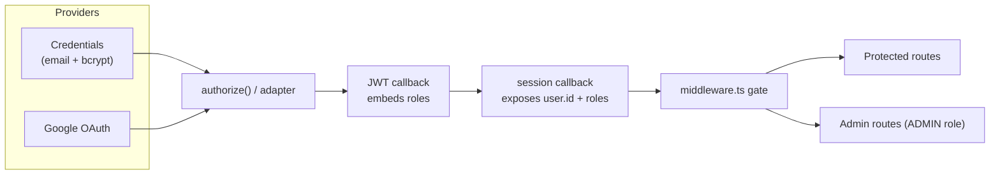

# Authentication Architecture

NextAuth v5 with a JWT session strategy and Prisma adapter.

## Flow

1. **Credentials login** — `authorize()` looks up the user, compares the bcrypt
   hash, rejects `BANNED`/`SUSPENDED` accounts, stamps `lastLoginAt`, and writes a
   `LOGIN` audit entry.
2. **JWT callback** — on sign-in, the user's role names are resolved once and
   embedded in the token (`token.roles`), avoiding a DB hit on every request.
3. **Session callback** — exposes `session.user.id` and `session.user.roles`
   (typed via `types/next-auth.d.ts`).
4. **Middleware** — `middleware.ts` redirects unauthenticated users away from
   protected routes and non-admins away from `/admin`.

## Account Security

- Passwords hashed with bcrypt (cost 12).
- Optional TOTP 2FA fields on `User` (`twoFactorEnabled`, `twoFactorSecret`).
- API keys are stored as SHA-256 hashes with a visible prefix and scopes.
- Registration is IP rate-limited (5/min) to deter abuse.
- Sessions expire after 7 days (JWT `maxAge`).
