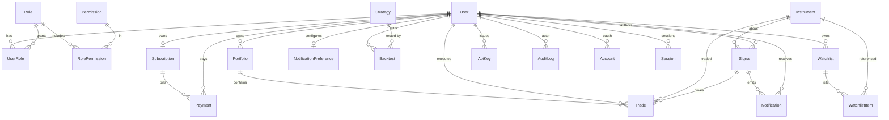

# Data Model & Relationships

PostgreSQL via Prisma. Full schema: `packages/db/prisma/schema.prisma`.

## Entity-Relationship Diagram

## Key Relationship Rules

- **RBAC** is modeled as many-to-many through `UserRole` and `RolePermission`
  join tables, so permissions are composable and roles are reusable.
- **Signal → Trade**: a signal may spawn many trades; deleting a signal sets
  `Trade.signalId` to null (`onDelete: SetNull`) to preserve trade history.
- **Instrument → Trade** uses `onDelete: Restrict` — you cannot delete an
  instrument that has trade history.
- **User cascade**: deleting a user cascades to sessions, accounts, portfolios,
  trades, backtests, notifications, api keys; audit logs are preserved
  (`SetNull`) for compliance.
- **Money** is stored in the smallest currency unit (`Int`), prices/quantities
  as `Decimal(24,8)` to avoid float drift.

## Indexing Strategy

Hot query paths are indexed: `User.email/status`, `Signal.status/createdAt/instrumentId`,
`Trade.userId/portfolioId/status`, `AuditLog.action/createdAt/resource`,
`Payment.userId/status`, `Subscription.status/plan`.
