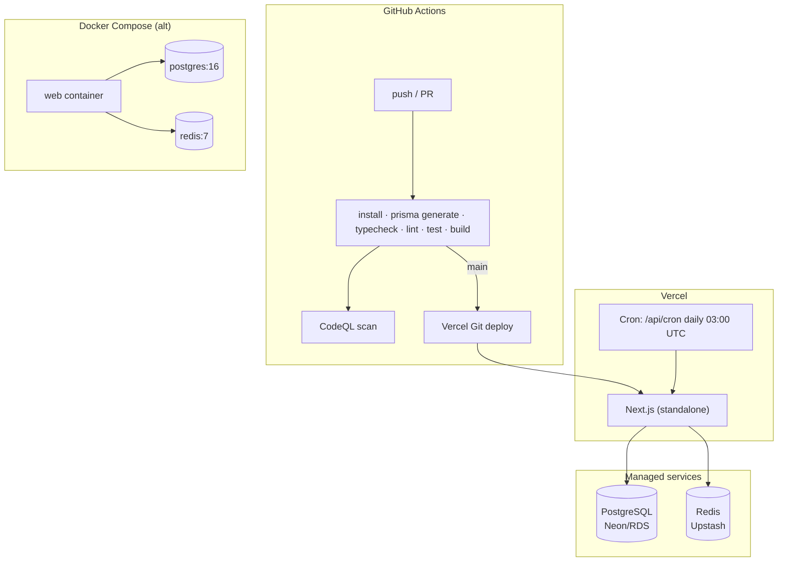

# Deployment Architecture

Two supported targets: **Vercel** (managed, primary) and **Docker Compose**
(self-host / on-prem).

## Vercel

- `vercel.json` sets the Turbo-filtered build command and registers the cron.
- **Vercel Hobby compatible:** the cron runs **once per day** (`0 3 * * *`) — Hobby permits
  at most one daily run and up to two cron jobs. Frequent/real-time signal generation is
  on-demand via `POST /api/engine/run` (the dashboard "Run signal engine" button), so no
  sub-daily schedule is needed. The cron route caps `maxDuration` at 60s (Hobby ceiling).
- Next.js runs in `output: "standalone"` mode.
- Postgres is Supabase (set `DATABASE_URL` pooled :6543 and `DIRECT_URL` direct :5432); Redis
  (Upstash) is optional — rate limiting and caching fail open without it.

## Docker

- Multi-stage `Dockerfile` (base → deps → builder → runner) produces a minimal
  non-root runner image from the Next standalone output.
- `docker-compose.yml` brings up `postgres`, `redis`, and `web` with health checks.
- Run: `cp .env.example .env && docker compose up --build`.

## Database lifecycle

- `pnpm db:generate` → Prisma client
- `pnpm db:migrate` (dev) / `prisma migrate deploy` (prod)
- `pnpm db:seed` → roles, permissions, admin user, instruments, feature flags

## Observability

- `/api/health` returns db + redis status (200 / 503) for load-balancer probes.
- Sentry DSN and `LOG_LEVEL` are wired via env for error + structured logging.
