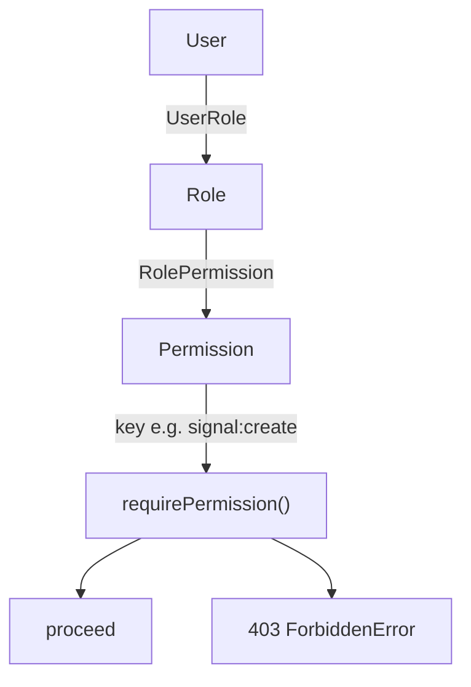

# RBAC Architecture

Role-Based Access Control with composable permissions, resolved at the edge
(middleware, coarse) and in route handlers (fine-grained).

## Roles (seeded, `isSystem`)

| Role     | Permissions                                                                 |
| -------- | --------------------------------------------------------------------------- |
| ADMIN    | all (`admin:access` super-grants everything)                                |
| ANALYST  | signal:create/read/update, backtest:run, portfolio:manage                   |
| USER     | signal:read, backtest:run, portfolio:manage                                 |

## Permission Keys

`resource:action` form — e.g. `signal:create`, `user:delete`, `billing:manage`,
`audit:read`, `backtest:run`, `portfolio:manage`, `admin:access`.

## Enforcement Layers

1. **Middleware (coarse)** — role-name check gates `/admin/*` to `ADMIN`.
2. **Route handlers (fine)** — `requirePermission(userId, key)` throws
   `ForbiddenError` → `403`. `admin:access` short-circuits as a super-permission.
3. **Caching** — a user's flattened permission set is cached in Redis for 5
   minutes (`rbac:perms:<userId>`), invalidated on role change.

This separation keeps the edge fast (no DB) while route handlers stay precise.
